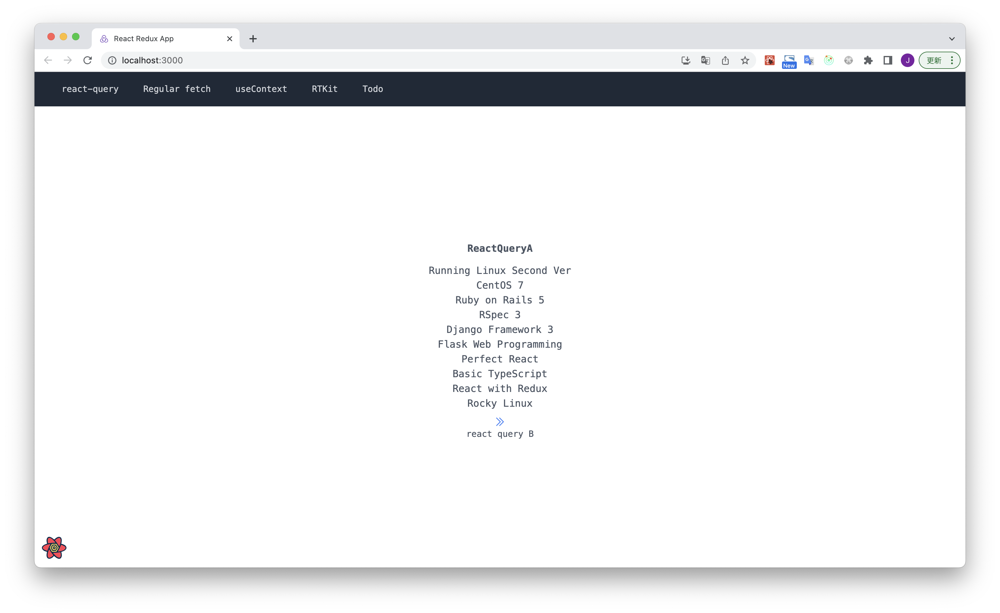
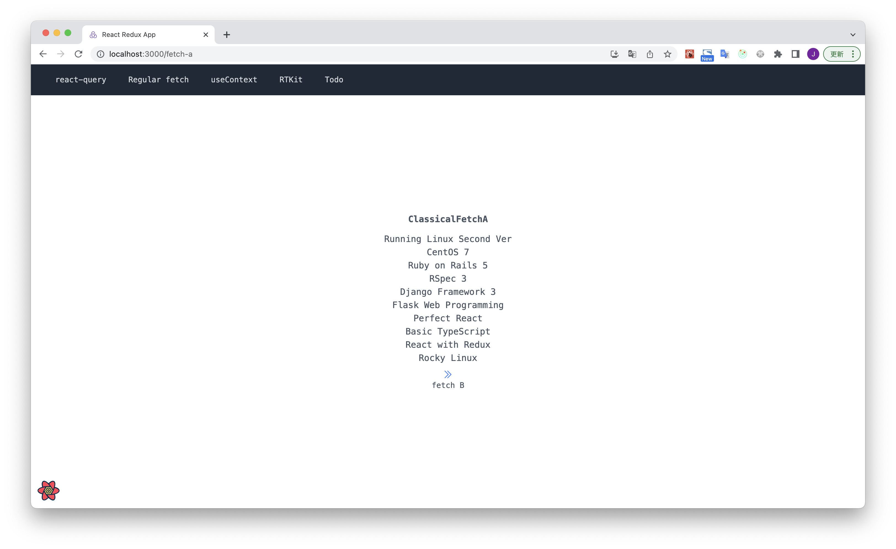
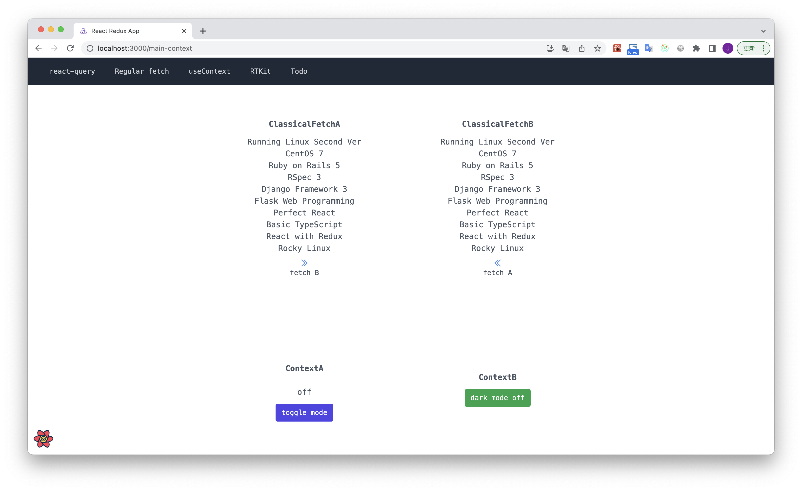
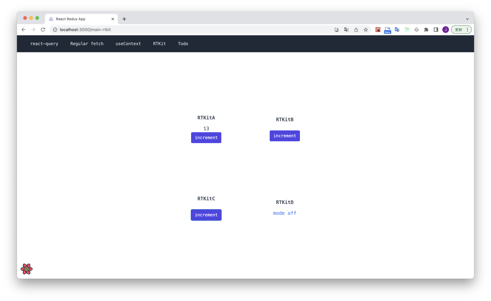
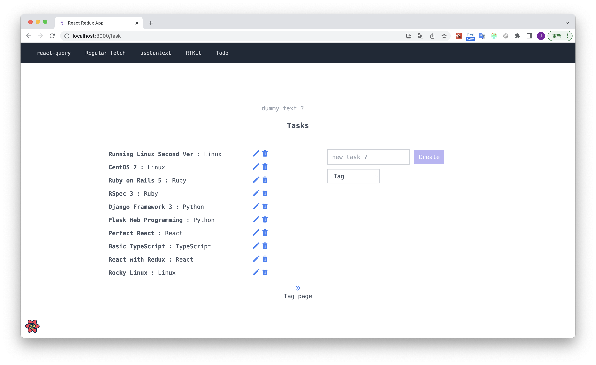

# High Performance React Web 開発

https://www.udemy.com/share/104CFu3@vZWokXsE60n4G3KVANnZpC-AriSKQsKYryoqQERsM0zr4DuDyH3cVza4mWSKhaa1-g==/

Kazu T+さんの講座でReact QueryとReduxでTodoアプリを作ります。
講座では二つのプロジェクトで行っていますが、私は一つにまとめてReact Routerで分岐する形を取りました。
このリポジトリはReactで作成したフロントエンド側です。

## nodeの環境構築

私はnvmでnodeのバージョン管理を行っていますが、nodenvなど他のものを使っても構いません。

```sh
brew install nvm
```

nvmで最新バージョンのnodeをインストールします。
nvm ls-remote --ltsでインストールできるnodeのリストが表示されます。
私は現時点の最新である18.15.0をインストールしました。

```sh
# インストールできるnodeのリストを確認
nvm ls-remote --lts

# nodeをインストールする。
nvm install 18.15.0

# インストールしたnodeのバージョンを確認
nvm ls

# インストールしたnodeのバージョンを指定
nvm use 18.15.0

# インストールしたnodeのバージョンをデフォルトで設定
nvm alias default v18.15.0
```

## プロジェクトの生成

```sh
create-react-app react-query-todos --template redux-typescript
```

Reactのプロジェクトの場合は色々と下準備が必要です。
[この文書](https://github.com/aJonghunPark/rtk-saga-crud/blob/main/doc/02.install.md)をご参照ください。
上記の文書からRedux-Saga、MUIはインストールする必要がありません。

## Getting Started

下準備が終わったら、yarn startでクライアントを立ち上げます。
apiサーバーのURLなどは環境毎に異なるため、gitではなく各サーバーの環境変数で管理するのが一般的です。
yarn startする前に.env.localファイルを作成します。

```sh
vim .env.local

REACT_APP_REST_URL=http://127.0.0.1:8000/api

:wq

yarn start
```

この場合、バックエンド側のサーバーも立ち上げないといけません。
バックエンド側のサーバーは[ここ](https://github.com/aJonghunPark/django_restapi)をご確認ください。

* React Queryのサンプル画面



* Regular Fetchのサンプル画面



* useContextのサンプル画面



* RTKのサンプル画面



* Todoアプリのサンプル画面


